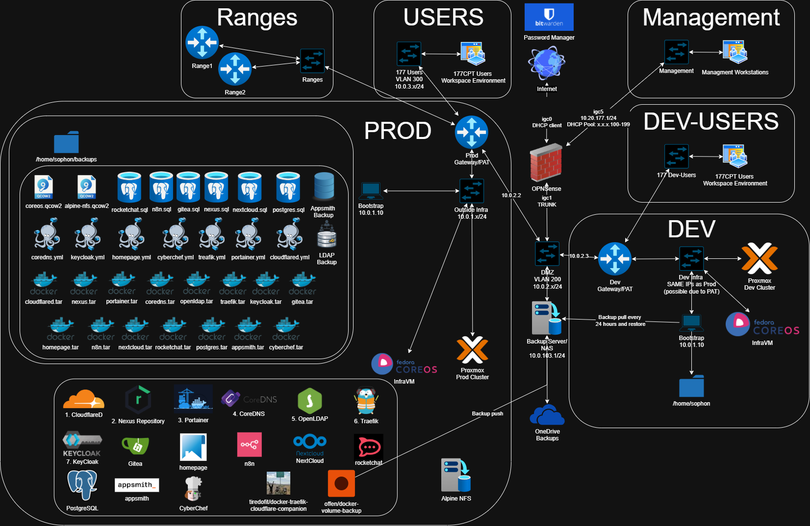

# Sophon Ansible Playbooks

Infrastructure as Code for deploying homelab services on Fedora CoreOS with Podman.

## Architecture Overview



### Key Components

| Component | Description |
|-----------|-------------|
| **Bootstrap** | The Ansible controller machine running `site.yml` |
| **Proxmox** | Virtualization host with API access |
| **NFS VM** | Alpine Linux VM providing NFS storage to Proxmox and InfraVM |
| **InfraVM** | Fedora CoreOS VM running all containers (Portainer, CoreDNS, Traefik, etc.) |

### Key Variables

| Variable | Source | Purpose |
|----------|--------|---------|
| `proxmox_host` | CLI/prompt | Proxmox API endpoint |
| `proxmox_password` | CLI/prompt/env | Proxmox authentication |
| `domain_name` | CLI/prompt | Base domain for services |
| `proxmox_airgapped` | CLI (default: false) | Enable air-gapped workflow |
| `infravm_cloudflared_tunnel_token` | Env `infravm_cloudflared_tunnel_token` | If set, enables cloudflared on InfraVM |
| `infravm_ansible_host` | Auto (default: `infravm.{{ domain_name }}`) | SSH target for InfraVM |
| `nfs_ip` | Auto-discovered | NFS server address |
| `infravm_ip` | Auto-discovered | InfraVM internal IP |

### NFS Directory Structure

```
/export/
├── template/
│   └── iso/                    # Proxmox ISO storage (VM images)
│       └── fedora-coreos-*.qcow2.iso
└── containers/                 # Container image tarballs
    ├── portainer-ce.tar
    ├── coredns.tar
    ├── traefik.tar
    └── ...
```

### Deployment Workflow

#### Step 1: Prepare Airgap (Optional)

**Condition:** Only when `proxmox_airgapped=true`

Bootstrap downloads all artifacts for offline deployment:
- Container images: `portainer-ce.tar`, `coredns.tar`, `traefik.tar`, `gitea.tar`, `nexus.tar`
- VM images: `fedora-coreos-*.qcow2`, `alpine-virt-*.qcow2`
- Builds `alpine-nfs.qcow2` with NFS packages pre-installed

After download, switch to the air-gapped network.

#### Step 2: Create NFS VM

**Condition:** Proxmox storage `sophon-nfs` does not exist

1. **Download Alpine image** (if not airgapped): Bootstrap downloads `alpine-virt-*.qcow2`
2. **Build NFS image**: Bootstrap uses `virt-customize` to inject NFS packages into Alpine image
3. **Upload to Proxmox**: Upload `alpine-nfs.qcow2` as `alpine-nfs.qcow2.iso` to Proxmox local storage
4. **Create VM**: Proxmox creates NFS VM from uploaded image
5. **Configure via QGA**: Set root password, network (static IP), create directory structure:
   - `/export/template/iso`
   - `/export/containers`
6. **Add Proxmox storage**: Register NFS export as Proxmox storage `sophon-nfs`

#### Step 3: Check Bootstrap Connectivity

**Purpose:** Determine if Bootstrap can directly access the NFS/InfraVM network

1. **Attempt NFS mount**: Bootstrap tries `mount -t nfs {{ nfs_ip }}:/export /tmp/nfs_test`
2. **Set facts:**
   - `nfs_reachable=true` → Bootstrap can reach NFS directly, no cloudflared needed
   - `nfs_reachable=false` AND `infravm_cloudflared_tunnel_token` is set → Enable cloudflared container on InfraVM

#### Step 4: Create InfraVM

1. **Download CoreOS image**:
   - Airgapped: Bootstrap uploads `fedora-coreos-*.qcow2.iso` to Proxmox
   - Online: Proxmox downloads via `download-url` API
2. **Generate Ignition config** with:
   - Static IP configuration
   - SSH public key (`infravm_ssh_public_key`)
   - NFS mount at `/mnt/nfs` → `{{ nfs_ip }}:/export`
   - Conditional cloudflared container service (when `infravm_cloudflared_tunnel_token` is set):
     - Runs `cloudflare/cloudflared:latest` container with `--network host`
     - Executes `tunnel --no-autoupdate run --token <token>`
3. **Create VM**: Proxmox creates InfraVM with Ignition passed via `fw_cfg`
4. **Set Ansible target**: `infravm_ansible_host` defaults to `infravm.{{ domain_name }}`
   (resolves via cloudflared tunnel when `infravm_cloudflared_tunnel_token` is set)

#### Step 5: Load Container Images

**Execution:** Via SSH to `{{ infravm_ansible_host }}`

For each image in `prestage_container_images`:
1. **Check NFS cache**: Does `/mnt/nfs/containers/{{ image_basename }}.tar` exist?
2. **If cached**: `podman load -i /mnt/nfs/containers/{{ image_basename }}.tar`
3. **If not cached**:
   - `podman pull {{ image }}`
   - `podman save -o /mnt/nfs/containers/{{ image_basename }}.tar {{ image }}`

Container image list:
- `docker.io/portainer/portainer-ce:2.39.0`
- `docker.io/coredns/coredns:1.12.0`
- `docker.io/osixia/openldap:1.5.0`
- `docker.io/quay.io/keycloak/keycloak:26.0`
- `docker.io/traefik:v3.2`
- `docker.io/sonatype/nexus3:3.72.0`
- `docker.io/gitea/gitea:1.21`

#### Step 6: Install Portainer

**Execution:** Via SSH to InfraVM

1. Create Portainer systemd service running `podman run portainer/portainer-ce`
2. Wait for Portainer API at `https://{{ infravm_ip }}:9443`
3. Initialize admin user with `portainer_admin_password`
4. *(Future)* Restore from backup if `/mnt/nfs/backups/current/portainer/portainer_data.tgz` exists

#### Step 7: Deploy CoreDNS

Deploy via Portainer Stacks API:
- Compose file with CoreDNS configuration
- DNS zone for `{{ domain_name }}`

#### Step 8: Deploy Traefik

Deploy via Portainer Stacks API:
- Reverse proxy configuration
- HTTPS certificates via Let's Encrypt or self-signed

#### Step 9: Deploy Gitea

Deploy via Portainer Stacks API:
- Git server with SSO integration (future)

#### Step 10: Deploy Nexus Repository

Deploy via Portainer Stacks API:
- Docker registry proxy
- RPM/Maven repository proxy

#### Future Steps

Core services deployed:
1. CoreDNS (DNS server)
2. OpenLDAP (directory service)
3. Keycloak (SSO/identity)
4. Traefik (reverse proxy)
5. Portainer (container management)
6. Nexus (artifact repository)
7. Gitea (Git server)

## Quick Start

### Online Mode (Recommended)

Deploy a complete homelab in one command:

```bash
nix develop  # Enter development shell
ansible-playbook site.yml
```

Alternatively to receive no interactive prompts:
```bash
nix develop
ansible-playbook site.yml \
  -e proxmox_host=10.1.1.2 \
  -e domain_name=mydomain.com \
  -e proxmox_password=my_secret_password
```

> **Note:** All playbooks run against `localhost` and manage remote infrastructure via APIs
> (Proxmox, Portainer, SSH). Variables are collected interactively via prompts or passed with `-e`.
> Gateway and subnet are automatically derived from the Proxmox network configuration.

You'll be prompted for:
1. **Proxmox API host** (e.g., `192.168.1.100` or `pve.example.com`)
2. **Domain name** (e.g., `homelab.local`)
3. **Proxmox password** (hidden input)

**IP addresses are auto-discovered:**
- **NFS Server IP** - First checks for existing `sophon-nfs` storage in Proxmox. If not found, uses `arp-scan` on the Proxmox node to discover used IPs, then selects the first available.
- **CoreOS VM IP** - First checks for existing `sophon-coreos` VM. If not found, selects the next available IP from the arp-scan results.

The `proxmox_shell` module executes `arp-scan -I <vnet>` directly on the Proxmox node to accurately discover IPs in use on the target network. If auto-discovery fails, you'll be prompted to enter IPs manually.

The playbook will then:
1. Check/deploy NFS server if needed (Alpine VM on Proxmox)
2. Download artifacts to NFS (via Proxmox in online mode)
3. Create and boot a CoreOS VM with Ignition config
4. Verify connectivity (or deploy bastion if unreachable)
5. Deploy Portainer, Traefik, CoreDNS, and all enabled services

### Air-Gapped Mode

For networks without internet access:

```bash
# ═══════════════════════════════════════════════════════════════════
# PHASE 1: Download artifacts (on internet-connected machine)
# ═══════════════════════════════════════════════════════════════════
nix develop
ansible-playbook prestage.yml

# Artifacts saved to /tmp/sophon_prestage/

# ═══════════════════════════════════════════════════════════════════
# SWITCH NETWORK: Disconnect from internet, connect to air-gapped LAN
# ═══════════════════════════════════════════════════════════════════

# ═══════════════════════════════════════════════════════════════════
# PHASE 2: Upload to NFS server
# ═══════════════════════════════════════════════════════════════════
ansible-playbook nfs-upload.yml

# ═══════════════════════════════════════════════════════════════════
# PHASE 3: Deploy infrastructure
# ═══════════════════════════════════════════════════════════════════
ansible-playbook site.yml -e proxmox_airgapped=true
```

### With Cloudflared Tunnel (Remote Access)

If you can't directly SSH to the deployed VMs but have a Cloudflare account:

```bash
export infravm_cloudflared_tunnel_token="your-tunnel-token"
ansible-playbook site.yml
```

The bastion VM will automatically configure Cloudflared for remote access.

### Scripting / CI (Skip Prompts)

```bash
ansible-playbook site.yml \
  -e coreos_proxmox_api_host=pve.example.com \
  -e domain_name=homelab.local \
  -e coreos_proxmox_api_password=secret
```

## Key Playbooks

| Playbook | Purpose |
|----------|---------|
| `site.yml` | Full orchestration - deploys everything |
| `prestage.yml` | Air-gapped Phase 1 - downloads artifacts |
| `nfs-upload.yml` | Air-gapped Phase 2 - uploads to NFS |
| `deploy.yml` | Deployment only (skips prestaging) |

| `nfs-content.yml` | NFS content population only |

## Common Options

## Prerequisites

- Python 3.10+
- Ansible 2.15+
- Access to Proxmox API

## Directory Structure

```
sophon/
├── flake.nix             # Nix development environment
├── ansible.cfg           # Ansible configuration
├── requirements.yml      # Galaxy dependencies
├── site.yml              # Master orchestration playbook
├── prestage.yml          # Air-gapped Phase 1 (download)
├── nfs-upload.yml        # Air-gapped Phase 2 (upload)
├── deploy.yml            # Deployment playbook
├── coreos.yml            # CoreOS VM playbook
├── bastion.yml           # Bastion VM playbook
├── roles/
│   ├── proxmox/          # Proxmox API interactions
│   ├── infravm/          # InfraVM (CoreOS VM running all containers)
│   ├── nfs_server/       # Custom Alpine NFS server (lazy-built qcow2)
│   ├── nfs_content/      # NFS artifact management (airgap prestaging only)
│   ├── connectivity_check/ # NFS mount reachability testing
│   ├── qga_remote_exec/  # QGA-based remote execution
│   ├── portainer_stack/  # Stack deployment API
│   ├── coredns/          # DNS server
│   ├── openldap/         # Directory service
│   ├── keycloak/         # Identity/SSO
│   ├── traefik/          # Reverse proxy
│   ├── dns_sync/         # Syncs Traefik routers to CoreDNS
│   ├── nexus/            # Artifact repository
│   └── gitea/            # Git server
└── tests/
    ├── molecule/         # Test configurations
    └── test.sh           # Molecule test runner
```

## Secrets Management

Secrets (passwords, API tokens) are handled via **environment variables** or **interactive prompts**.

### Environment Variables

```bash
# Set secrets as environment variables
export PROXMOX_PASSWORD="your-proxmox-password"
export infravm_cloudflared_tunnel_token="your-tunnel-token"  # Optional

# Run playbook (prompts only for unset values)
ansible-playbook site.yml
```

### CLI Overrides

```bash
# Pass secrets directly (useful for CI/CD)
ansible-playbook site.yml \
  -e proxmox_host=10.0.0.10 \
  -e proxmox_password=secret \
  -e coreos_ip=10.0.0.100 \
  -e coreos_gateway=10.0.0.1 \
  -e domain_name=sophon.local
```

### Interactive Prompts

When variables are not set, `site.yml` will prompt for:
1. Proxmox API host
2. Domain name  
3. Proxmox password (hidden)
4. CoreOS VM static IP
5. CoreOS gateway
6. NFS server IP (defaults to gateway subnet .35)

3. Generate client secrets:
```bash
openssl rand -hex 32
```

4. The realm is auto-provisioned via `realm-export.json.j2`

## Deployment Order

The `site.yml` playbook deploys services in dependency order:

1. **nfs_server** - NFS storage VM (if needed)
2. **infravm** - InfraVM (CoreOS VM running Portainer + all containers)
3. **coredns** - DNS server
4. **openldap** - Directory service
5. **keycloak** - SSO (depends on openldap if LDAP enabled)
6. **traefik** - Reverse proxy
7. **dns_sync** - Syncs Traefik routers to CoreDNS
8. **nexus** - Artifact repository
9. **gitea** - Git server

## Podman & NFS Architecture

All roles are designed for Fedora CoreOS with Podman:

- Uses `podman` commands (no Docker daemon required)
- Compose files deployed via Portainer API
- Container images loaded from NFS-served tarballs
- RPM packages installed from NFS at first boot
- Systemd socket activation for rootless containers

### NFS Server Layout

The NFS server (default `10.1.1.35`) serves as:
- **Nexus docker-proxy backend**: `/exports/nexus/docker-proxy/`
- **Nexus yum-proxy backend**: `/exports/nexus/yum-proxy/`
- **Proxmox ISO storage**: `/var/lib/vz/template/iso/`

This allows Nexus to proxy cached artifacts without internet access.

## Air-Gapped Deployment

For fully disconnected networks, follow this three-phase workflow:

### Phase 1: Prestage (Internet Required)

Downloads all artifacts to local staging directory:

```bash
nix develop
ansible-playbook prestage.yml
```

**Downloaded artifacts** (`/tmp/sophon_prestage/`):
- Fedora CoreOS QCOW2 image
- Alpine Linux cloud image (bastion)
- Container images: Portainer, Traefik, CoreDNS, OpenLDAP, Nexus, etc.
- RPM packages: qemu-guest-agent + dependencies
- Butane binary

### Phase 2: NFS Upload (Air-Gapped Network)

After switching networks:

```bash
ansible-playbook nfs-upload.yml
```

**NFS destinations** (on `nfs_ip`):
- `/var/lib/vz/template/iso/` - VM images
- `/exports/nexus/docker-proxy/` - Container tarballs
- `/exports/nexus/yum-proxy/` - RPM packages
- `/exports/sophon/bin/` - Butane binary

### Phase 3: Deploy

```bash
ansible-playbook site.yml -e proxmox_airgapped=true
```

### Key Variables

```yaml
# group_vars/all.yml
proxmox_airgapped: false          # Set true for air-gapped
nfs_ip: "10.1.1.35"     # NFS server address
nfs_docker_images_path: "/exports/nexus/docker-proxy"
nfs_rpm_packages_path: "/exports/nexus/yum-proxy"
```

## Remote Access via Cloudflared

When the Ansible controller cannot directly reach the InfraVM network, cloudflared
provides tunnel access. This is automatically detected and configured.

### How It Works

1. Bootstrap attempts to mount NFS from the target network
2. If mount fails AND `infravm_cloudflared_tunnel_token` is set:
   - InfraVM Ignition config includes cloudflared container service
   - InfraVM pulls and runs `cloudflare/cloudflared:latest` container on boot
3. Ansible connects to `infravm.{{ domain_name }}` via the tunnel

### Usage

```bash
export infravm_cloudflared_tunnel_token="your-tunnel-token"
ansible-playbook site.yml
```

## Testing

### Molecule (Role Testing)

```bash
# Install test dependencies
pip install molecule molecule-docker ansible-lint yamllint

# Run all molecule tests
./tests/test.sh

# Test a specific role
cd roles/traefik
molecule -c ../../tests/molecule/base.yml test
```

### Integration Testing (Dev CoreOS VM)

For full integration testing, deploy to a development CoreOS VM:

```bash
# Deploy with prompted values (or pass with -e)
ansible-playbook site.yml

# Verify services
ssh admin@<coreos-ip> "podman ps"
curl -k https://<coreos-ip>:9443/api/status  # Portainer
curl http://<coreos-ip>:3000                  # Gitea
```

## Linting

```bash
# YAML lint
yamllint -c .yamllint .

# Ansible lint
ansible-lint -c .ansible-lint

# Pre-commit (if configured)
pre-commit run --all-files
```

## Troubleshooting

### Common Issues

**SSH Connection Refused**
```bash
# Check SSH key permissions
chmod 600 ~/.ssh/sophon_prod
ssh -i ~/.ssh/sophon_prod admin@10.0.0.100
```

**Portainer API Errors**
```bash
# Verify Portainer is running
curl -k https://10.0.0.100:9443/api/status
```

**Image Load Failures**
```bash
# Verify HTTP file server
curl http://localhost:8000/traefik.tar -o /dev/null -w "%{http_code}"
```

**Stack Deployment Failures**
```bash
# Check Portainer logs on CoreOS
ssh admin@10.0.0.100 "podman logs portainer"
```

### Logs

```bash
# View container logs on CoreOS
ssh admin@coreos-ip "podman logs <container-name>"

# View systemd journal
ssh admin@coreos-ip "journalctl -u podman"
```

## Configuration Reference

See the role defaults files (`roles/*/defaults/main.yml`) for all available variables.

Key settings:
- `domain_name` - Base domain for all services
- `coreos_ip` - Target CoreOS VM IP
- `portainer_port` - Portainer API port (default: 9443)
- `http_file_server_port` - Image distribution server port (default: 8000)
- `validate_certs` - TLS certificate validation (default: false for dev)

## Contributing

1. Create a feature branch
2. Add/modify roles following ansible-nas patterns
3. Include molecule tests for new roles
4. Run linting before submitting PR
5. Update documentation as needed


# example for 177cpt
ansible-playbook site.yml -e proxmox_host=pm.177cpt.com -e proxmox_port=443 -e domain_name=177cpt.com -e proxmox_node=pve-prod-01 -e proxmox_password=example -e portainer_admin_password=example -e cloudflared_tunnel_token=example -e proxmox_iso_storage_id=fs-storage -e nfs_image_storage_path=/mnt/pve/fs-storage/template/iso -e vnet_vlan=60 -e nfs_ip=10.0.60.2 -e infravm_ip=10.0.60.3 -e vnet_gateway=10.0.60.1 -e vnet_cidr=24 -e coredns_domain_name=177cpt.com -e infravm_portainer_url=https://portainer.177cpt.com -e coredns_cf_token=example -e coredns_cf_zone_id=3fd93df8ed40e10b5b0de6ab1b1cface -e coredns_cf_account_id=6f64a8ecc4e31470814553e879a9db77 -e coredns_cf_tunnel_id=5c4fccc8-6376-479b-8131-7cd8cc033473 -e traefik_acme_email=admin@177cpt.com
